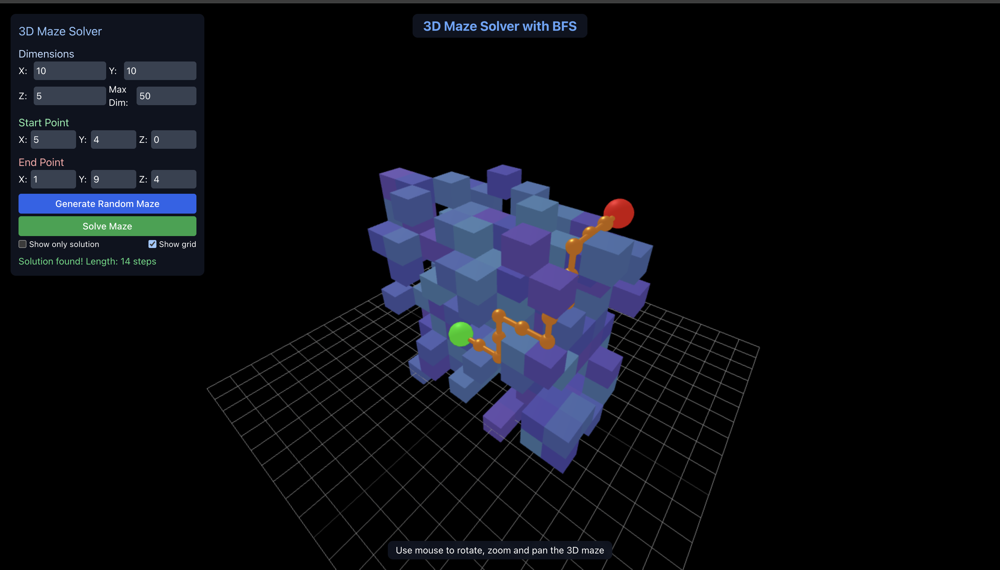

# 3D Maze Solver with BFS

An interactive 3D maze generator and solver using Breadth-First Search (BFS) algorithm, built with React and Three.js.



## Features

- **Interactive 3D Visualization**: Fully navigable 3D environment to explore the maze
- **Customizable Maze Generation**: Adjust X, Y, and Z dimensions up to 100 units in each direction
- **BFS Pathfinding Algorithm**: Finds the optimal (shortest) path from start to end
- **Dynamic Controls**:
  - Adjust maze dimensions
  - Set custom start and end points
  - Toggle grid visibility
  - Show only the solution path for complex mazes
- **Real-time Interaction**: Rotate, zoom, and pan to explore the maze from any angle

## How It Works

### Maze Generation

The app creates a random 3D maze with a customizable structure:
- Walls are represented as blue cubes
- The start point is a green sphere
- The end point is a red sphere
- The algorithm ensures that any generated maze has at least one solution

### Breadth-First Search (BFS)

The BFS algorithm works by exploring all possible paths outward from the starting point in layers:

1. Start at the beginning node
2. Explore all directly connected nodes
3. For each of those nodes, explore all their connected nodes
4. Continue until reaching the end point

BFS guarantees finding the shortest path in unweighted graphs (where all steps have equal cost).

## Usage

1. **Adjust Maze Settings**: Set dimensions and complexity using the control panel
2. **Generate Maze**: Click "Generate Random Maze" to create a new random maze
3. **Solve Maze**: Click "Solve Maze" to find and visualize the shortest path
4. **Explore**: Use mouse controls to rotate, zoom, and pan around the 3D maze
   - Left-click and drag to rotate
   - Right-click and drag to pan
   - Scroll to zoom in/out

## Technologies Used

- **React**: Framework for building the user interface
- **Three.js**: 3D rendering library for creating the maze visualization
- **OrbitControls**: Camera system for intuitive navigation
- **Tailwind CSS**: Styling framework for the UI components

## Implementation Details

### Technical Approach

- **3D Rendering**: Uses WebGL through Three.js for efficient 3D graphics
- **Maze Representation**: 3D array where each cell represents a position that is either empty or a wall
- **Pathfinding**: Implements BFS with a queue-based approach for finding the shortest path
- **UI Overlay**: Semi-transparent control panel for adjusting maze parameters

### Algorithm Highlights

```javascript
// Simplified BFS algorithm pseudocode
function solveMazeBFS(maze, start, end) {
  const queue = [start];
  const visited = new Set();
  const parent = new Map();
  
  while (queue is not empty) {
    const current = queue.shift();
    
    if (current == end) {
      return reconstructPath(parent, start, end);
    }
    
    for each direction (up, down, left, right, forward, backward) {
      const next = move(current, direction);
      
      if (isValid(next) && not visited(next) && not isWall(next)) {
        queue.push(next);
        visited.add(next);
        parent.set(next, current);
      }
    }
  }
  
  return null; // No path found
}
```

## Performance Considerations

- For large mazes (>25×25×25), rendering performance may decrease on lower-end devices
- Shadow effects are disabled to improve performance
- The "Show only solution" toggle helps visualize the path in complex mazes

## Future Enhancements

- Additional maze generation algorithms (recursive division, etc.)
- Alternative pathfinding algorithms (A*, Dijkstra's)
- Custom maze import/export functionality
- Performance optimizations for larger mazes

## License

This project is available under the MIT License.

## Acknowledgments

- Three.js community for excellent documentation and examples
- React team for creating a robust framework for interactive applications